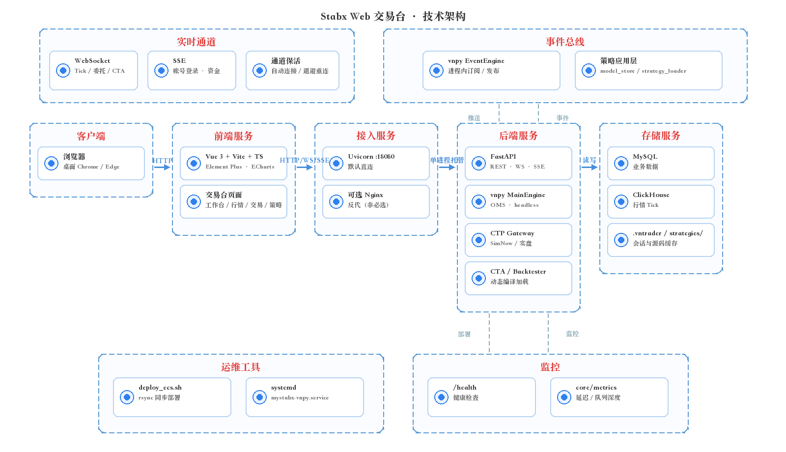
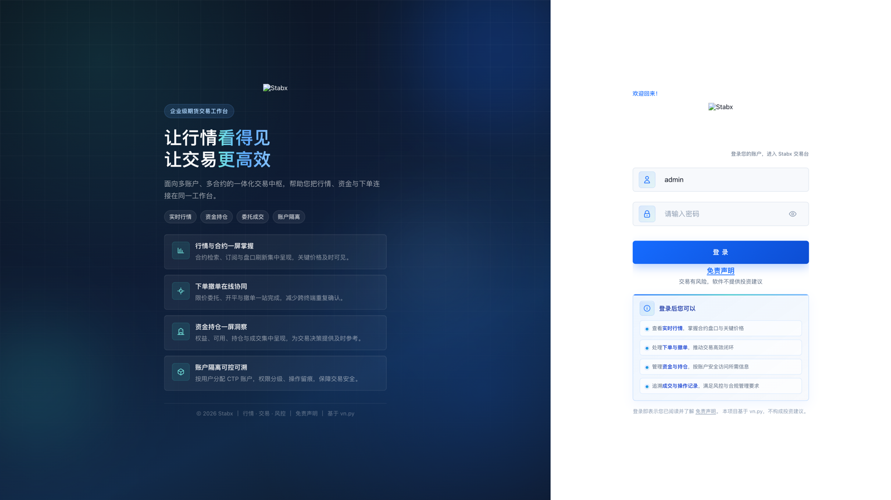
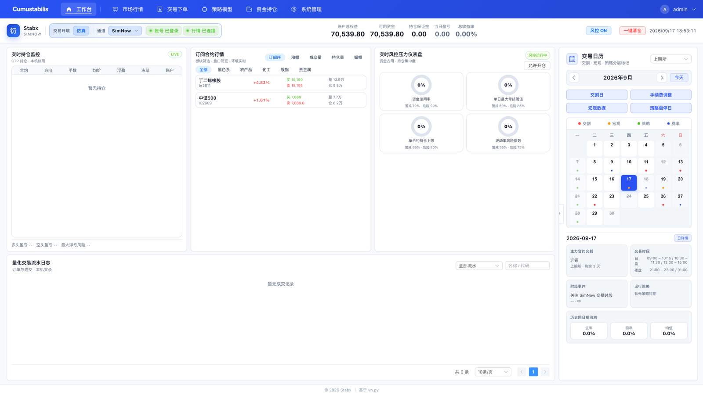
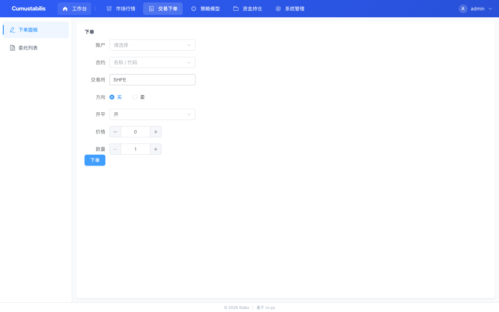
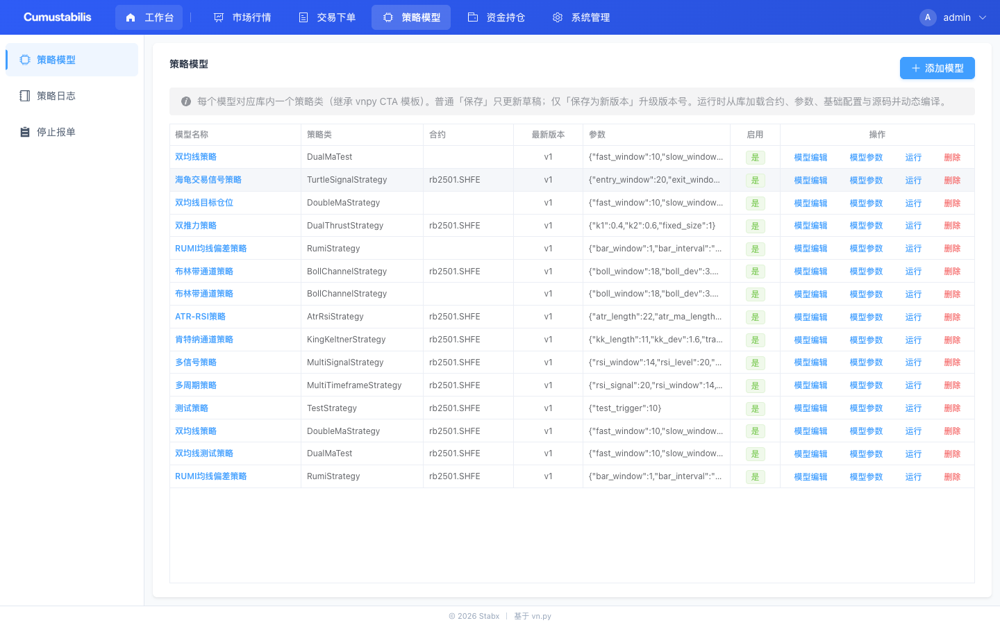

# 从 0 到 1 搭建你的 Web 期货量化交易台 · 系列导读

> 一个开源项目的完整实战连载：从环境准备、headless 引擎，到对接 SimNow 模拟环境、局域网部署上线。
> ⚠️ 本系列是「量化交易系统**开发**」技术内容，不构成投资建议，不荐品种、不喊单、不承诺收益。

## 这个系列讲什么

用 **Vue 3 + FastAPI + 进程内 vnpy 引擎**，从零搭一个**浏览器里用的期货交易台**：

- 不是桌面 Qt 客户端，而是 **B/S 架构**：浏览器登录、连柜台、看行情、下单、查资金持仓；
- 支持**多用户、多 CTP 账户、用户级隔离 + 管理员**；
- 目标读者：会一点 Python / 前端的开发者、想给 vnpy 套 Web 壳的量化爱好者、想了解"交易系统怎么搭"的工程师。

整体分层如下（前端 SPA → FastAPI → 进程内 headless vnpy → MySQL / ClickHouse）：

## 目录（10 篇，按顺序读）

| 篇 | 标题 | 核心内容 |
|---|---|---|
| 01 | 项目定位与技术选型 | 为什么把 vnpy 做成 Web 版；B/S 架构图；技术栈 |
| 02 | 环境准备 | Python/Node/MySQL/CTP；`install_macos.sh` / `install_linux.sh` |
| 03 | 无界面启动 vnpy 引擎 | `MainEngine`/`EventEngine` headless 化；为什么不能 `--workers` |
| 04 | 后端骨架：FastAPI + 配置 + MySQL | 应用生命周期、`.env`、配置、建表、`/health` |
| 05 | 账户与通道：多账户隔离与加密 | 账户 CRUD、Fernet 加密、多 gateway、自动重连 |
| 06 | 行情中心：从 CTP 到浏览器 Tick | 订阅/退订、事件桥接、WebSocket、分时图 |
| 07 | 交易中心：下单、撤单与二次确认 | OMS、下单/撤单接口、事件回推 |
| 08 | 前端交易台：Vue 3 实战 | 路由、导航、Pinia、WS 客户端、页面 |
| 09 | 对接 SimNow 模拟环境 | 注册、经纪商代码、通道配置、第一笔模拟委托 |
| 10 | 一键部署与上线检查清单 | `start.sh`、ECS、Nginx、systemd、常见坑 |

## 配套资源

- 开源仓库：`mystabx_vnpy`（Gitee / GitHub）
- 设计文档：仓库 `docs/` 目录（架构、存储、账户隔离、WebSocket 协议、实施路线图、CTA 规划等）

### 成品长什么样

截图取自公网演示环境，系列写完后你会得到类似界面：

<table width="100%">
  <tr>
    <th width="50%" align="center">登录</th>
    <th width="50%" align="center">工作台</th>
  </tr>
  <tr>
    <td width="50%" valign="top">
      
    </td>
    <td width="50%" valign="top">
      
    </td>
  </tr>
  <tr>
    <th width="50%" align="center">市场行情</th>
    <th width="50%" align="center">交易下单</th>
  </tr>
  <tr>
    <td width="50%" valign="top">
      
    </td>
    <td width="50%" valign="top">
      
    </td>
  </tr>
</table>

平台还内置 CTA 策略模型与回测界面（进阶内容，见星球）：

## 阅读建议

- 每篇末尾有「下一篇预告」，按顺序看即可形成完整闭环；
- 想直接跑通，可以从 02 开始搭环境，03–09 边看边写；
- 代码片段都是真实可用的，路径/命令与仓库一致，直接复制即可。

> 🎁 本文是免费连载的第 0 篇。系列文章的**源码逐行解读、架构设计取舍、实盘踩坑记录、一对一答疑**等进阶内容，已沉淀在知识星球 **「MyStabx 期货量化交易平台」**。

扫描下方优惠券二维码，领取新人立减券（¥88，限量 100 张，有效至 2026/12/31）：

