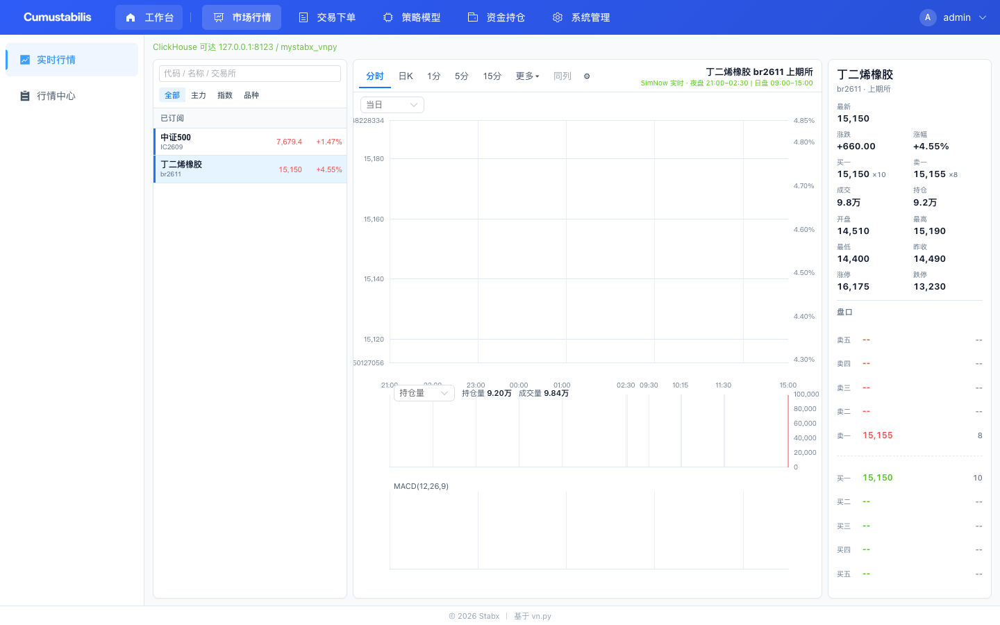

# 06 行情中心：从 CTP 行情到浏览器实时 Tick

> 📌 系列第 6 篇 ｜ 本文目标：看懂一条 tick 从柜台到前端的完整链路 ｜ 预计阅读 10 分钟
> ⚠️ 本系列是「量化交易系统开发」技术内容，不构成投资建议。

## 一、一条 tick 的旅程

```
CTP 行情回调
  → vnpy EventEngine.put(EVENT_TICK)
  → core/events.py 的 on_tick 处理器
      ① record_tick：写入内存缓冲（当日分时）
      ② enqueue_tick：异步入队（ClickHouse 可选存储）
      ③ publish_threadsafe：转发到 WebSocket
  → 前端 WS 收到 "tick" → 更新 Pinia store → 页面刷新
```

## 二、事件桥接：`core/events.py`

这是"vnpy 事件 → Web 消息"的翻译层：

```python
def on_tick(event: Event) -> None:
    payload = tick_payload(event.data)   # 转成 JSON dict
    record_tick(payload)                 # 内存分时
    enqueue_tick(payload)                # 异步写 ClickHouse（软失败）
    publish_threadsafe(envelope("tick", payload))  # 推给前端
```

`publish_threadsafe` 会把消息塞进 asyncio 事件循环，由 `WsHub` 分发给所有"可见且订阅了该 topic"的连接。tick、order、trade、position、account、contract、log 都是这么桥接的。

## 三、序列化：`core/serialize.py`

vnpy 的数据对象（`TickData` 等）不能直接 JSON，需要转 dict。`core/serialize.py` 统一收口：

```python
def envelope(msg_type, data):
    return {"type": msg_type, "ts": <毫秒时间戳>, "data": data}

def tick_payload(tick):
    return {"symbol": tick.symbol, "exchange": ..., "last_price": ...,
            "bid_price_1": ..., "gateway_name": tick.gateway_name, ...}
```

所有 WS 消息统一是 `{type, ts, data}` 三段式信封，前端按 `type` 分发。

## 四、订阅与退订：`features/market/api.py`

```python
@router.post("/api/market/subscribe")
def subscribe(body: SubscribeBody, user=Depends(current_user)):
    # 1. 权限校验（只能订自己可见账户）
    # 2. 先持久化订阅（upsert_subscription）
    # 3. 再调 runtime.me.subscribe(...)
```

订阅会**先落 MySQL 再发起 CTP 订阅**——这样即使 CTP 中途抖动，前端也不至于"界面显示已订阅、实际没订上"。退订则反过来：先清 CTP 的 `subscribed` 集合、调 `unSubscribeMarketData`，再删库。

其它接口：

```
GET  /api/contracts                 # 合约查询（按可见账户过滤）
GET  /api/ticks                     # 当前所有最新 tick
GET  /api/market/session-ticks      # 某交易日的分时 tick
GET  /api/market/trade-dates        # 最近 10 个交易日
GET  /api/market/bars               # K 线（默认 mock，可插 RQData）
GET  /api/market/subscriptions      # 我的订阅列表
```

实际行情界面（订阅 / 五档 / 分时）：



## 五、前端怎么收：`ui/ws.ts`

前端 WS 连接建立后，先 `auth`，再 `subscribe` 订阅一组 topic：

```ts
socket.send(JSON.stringify({ type: "subscribe", data: { topics:
  ["tick","order","trade","position","account","gateway","log","contract"] } }))
```

收到消息后 `dispatch()` 按 `msg.type` 分流：

```ts
if (msg.type === "tick") market.upsertTick(msg.data);
if (msg.type === "order") trade.upsertBy(trade.orders, msg.data, "vt_orderid");
...
```

同时封装了心跳（15s ping）和指数退避重连。

## 六、分时图的一个性能细节

SimNow 一天的 tick 有 1 万~7 万条，全量推给浏览器会让前端卡死。所以 `/api/market/session-ticks` 做了**按分钟降采样**：只保留每分钟最后一笔、并取该分钟累计成交量较大的那个值，再合并"内存 + OMS + ClickHouse"三路数据去重。这是实战里必须处理的细节。

## 七、小结

- 行情链路 = 事件桥接 + 序列化 + WS 分发；
- 订阅先落库再发 CTP，退订反向；
- 高频 tick 要降采样，别把几十万条直接甩给浏览器。

下一篇：交易中心，看下单/撤单和二次确认。

> 🎁 事件桥接的完整事件类型、WS topic 过滤机制、tick 缓冲与去重，已沉淀在知识星球 **「MyStabx 期货量化交易平台」**。

扫描下方优惠券二维码，领取新人立减券（¥88，限量 100 张，有效至 2026/12/31）：


