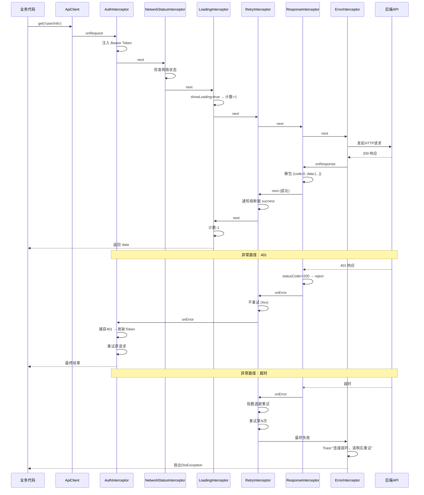
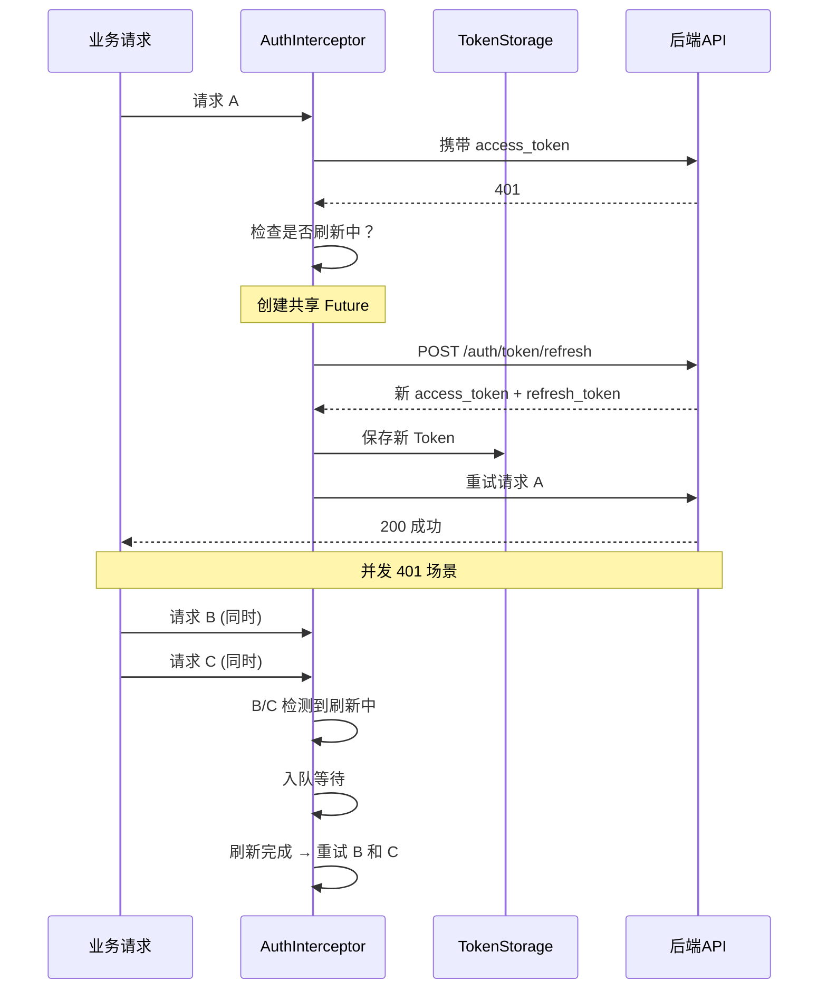
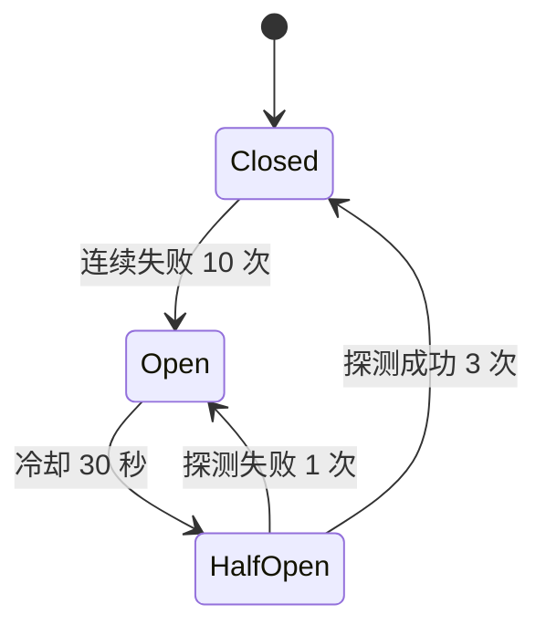

# Flutter 网络服务层使用指南

> 基于 Dio 6 层拦截器链的网络请求封装，支持无感 Token 刷新、弱网优化、熔断保护。

---

## 一、架构总览

```
lib/services/
├── api_result.dart              ← 统一响应模型 { code, msg, data }
├── index.dart                   ← barrel export
├── api/
│   ├── index.dart               ← API 模块 barrel export
│   ├── base_api.dart            ← API 基类（get/post/put/listPage）
│   ├── auth_api.dart            ← 认证登录
│   ├── user_api.dart            ← 当前用户资料
│   ├── user_admin_api.dart      ← 后台用户管理
│   ├── system_api.dart          ← 菜单树
│   ├── notice_api.dart          ← 通知公告
│   ├── dept_api.dart            ← 部门
│   ├── role_api.dart            ← 角色
│   └── position_api.dart        ← 岗位
├── network/
│   ├── index.dart               ← barrel export
│   ├── api_client.dart          ← ApiClient 单例
│   ├── network_status.dart      ← 网络质量检测
│   ├── circuit_breaker.dart     ← 熔断器
│   ├── request_queue.dart       ← 断网请求队列
│   ├── cookie_safe_adapter.dart ← Cookie 异常抑制
│   ├── web_http_adapter_stub.dart
│   └── interceptors/
│       ├── auth_interceptor.dart       ← Token 注入 + 401 自动刷新
│       ├── network_status_interceptor.dart ← 断网入队
│       ├── loading_interceptor.dart    ← 全局 Loading
│       ├── retry_interceptor.dart      ← 指数退避重试
│       ├── response_interceptor.dart   ← 业务码解析
│       └── error_interceptor.dart      ← 统一错误提示
├── storage/
│   ├── storage_service.dart    ← SharedPreferences 封装
│   └── token_storage.dart      ← 双 Token 存取
└── models/
    └── user_profile.dart       ← 用户信息模型
```

---

## 二、拦截器链

### 2.1 执行顺序

```
请求 → Auth → NetworkStatus → Loading → Retry → Response → Error → 响应/错误
       ┃         ┃            ┃         ┃         ┃         ┃
       ┃ 注入    ┃ 断网时     ┃ 显示    ┃ 失败时   ┃ 解析    ┃ 显示
       ┃ Token   ┃ 入队等待   ┃ Loading ┃ 自动重试 ┃ 业务码  ┃ 错误提示
       ┗━━━━━━━━━┻━━━━━━━━━━━┻━━━━━━━━━┻━━━━━━━━━┻━━━━━━━━━┛
```

### 2.2 各拦截器职责

| 拦截器                     | 阶段            | 职责                                                              |
| -------------------------- | --------------- | ----------------------------------------------------------------- |
| `AuthInterceptor`          | 请求前 + 响应后 | 注入 Bearer Token；捕获 401 → 共享 Future 刷新 Token → 重试原请求 |
| `NetworkStatusInterceptor` | 请求前          | 断网时将请求加入队列，网络恢复后自动冲刷                          |
| `LoadingInterceptor`       | 请求前/后       | 引用计数控制全局 Loading 显隐                                     |
| `RetryInterceptor`         | 响应后(错误)    | 指数退避 + 随机抖动重试，集成熔断器                               |
| `ResponseInterceptor`      | 响应后          | 校验 HTTP 状态码，解包 `{code, msg, data}` 结构                   |
| `ErrorInterceptor`         | 响应后(错误)    | 非业务错误（超时/断网/未知）统一 Toast 提示                       |

### 2.3 拦截器链协作流程



---

## 三、ApiClient 使用

### 3.1 初始化

在 `lib/global.dart` 中统一初始化：

```dart
// 初始化网络状态监听
NetworkStatusService.instance.init();

// 初始化 API 客户端
ApiClient.instance.init(baseUrl: AppEnv.apiUrl);
```

### 3.2 请求方法

所有方法返回泛型 `T`，自动经过拦截器链处理。

```dart
// GET — 获取数据
final user = await ApiClient.instance.get<Map<String, dynamic>>('/user/info');

// POST — 提交数据
final result = await ApiClient.instance.post<Map<String, dynamic>>(
  '/auth/login',
  data: {'username': 'admin', 'password': 'xxx'},
);

// PUT — 更新数据
await ApiClient.instance.put('/user/info/update', data: body);

// DELETE — 删除
await ApiClient.instance.delete('/user/1');

// 文件上传
await ApiClient.instance.upload('/file/upload', formData: FormData.fromMap({...}));
```

### 3.3 请求控制参数

```dart
// 隐藏 Loading 动画（登录等场景）
await ApiClient.instance.post('/auth/login', showLoading: false);

// 隐藏错误提示（由调用方自行处理）
await ApiClient.instance.get('/user/info', showError: false);

// 同时控制
await ApiClient.instance.get('/public/data',
  showLoading: false,
  showError: false,
);
```

### 3.4 请求取消

```dart
// 取消所有进行中的请求
ApiClient.instance.cancelAllRequests();

// 取消指定路径的请求
ApiClient.instance.cancelRequest('/user/list');
```

---

## 四、无感 Token 刷新

### 4.1 流程



### 4.2 关键特性

- **共享 Future**：多个并发 401 请求共享同一个刷新 Future，只刷新一次 Token
- **自动重放**：刷新成功后自动重试所有排队请求
- **递归保护**：`/token/refresh` 端点自身 401 不会触发递归刷新
- **降级**：刷新失败时调用登出流程，跳转登录页

### 4.3 Token 存储

```dart
// 存储双 Token
await TokenStorage.instance.saveTokens(
  accessToken: data['access_token'],
  refreshToken: data['refresh_token'],
);

// 读取
final token = TokenStorage.instance.getAccessToken();

// 清除（登出时）
await TokenStorage.instance.clear();
```

---

## 五、弱网优化

### 5.1 动态超时

根据网络质量自动调整 Dio 超时时间：

| 网络质量    | 触发条件        | 超时时间      |
| ----------- | --------------- | ------------- |
| `excellent` | WiFi / 以太网   | 10s           |
| `good`      | 4G / 移动网络   | 15s           |
| `poor`      | 3G / 2G（弱网） | 30s           |
| `none`      | 无网络          | —（请求入队） |

```dart
// 初始化网络监听
NetworkStatusService.instance.init();

// 获取当前网络质量
final quality = NetworkStatusService.instance.currentQuality;
// → NetworkQuality.excellent / good / poor / none

// 检查网络是否可用
final connected = NetworkStatusService.instance.isConnected;
```

### 5.2 指数退避重试

`RetryInterceptor` 重试策略：

| 条件                | 行为                                      |
| ------------------- | ----------------------------------------- |
| GET / HEAD          | 无条件重试，最多 3 次                     |
| POST / PUT / DELETE | 仅 `connectionError`/`timeout` 类错误重试 |
| 4xx 错误            | 不重试                                    |
| 请求已取消          | 不重试                                    |
| 熔断器打开          | 不重试                                    |

延迟计算公式：

```
delay = baseDelay × 2^retryCount + random(0, baseDelay × jitterRatio × 2^retryCount)
```

| 重试次数 | 正常网络 (base=500ms) | 弱网 (base=2000ms)  |
| -------- | --------------------- | ------------------- |
| 第 1 次  | 500~650ms             | 2000~2600ms         |
| 第 2 次  | 1000~1300ms           | 4000~5200ms         |
| 第 3 次  | 2000~2600ms           | 不重试(弱网最多2次) |

### 5.3 熔断器



- **作用域**：全局单一实例（服务器过载时全局熔断）
- **半开状态**：允许最多 3 个探测请求，成功的探测会逐渐恢复服务

### 5.4 断网请求队列

- 断网时请求不直接失败，入队等待
- 队列最大容量 50，满时丢弃最早入队的请求
- 网络恢复后自动按序执行队列中的请求

```dart
// NetworkStatusService 在网络恢复时自动触发冲刷
// 无需手动调用
```

---

## 六、BaseApi 使用

### 6.1 定义新 API 类

```dart
import '../api_result.dart';
import 'base_api.dart';

/// 消息 API
class MessageApi extends BaseApi {
  /// 消息列表
  static Future<PageResult<Map<String, dynamic>>> list({
    PageParams params = const PageParams(),
  }) async {
    return BaseApi.listPage('/system/message/list', params: params);
  }

  /// 发送消息
  static Future<void> send(String content) async {
    await BaseApi.post('/system/message/send', data: {'content': content});
  }
}
```

### 6.2 基类方法说明

| 方法                 | 签名                                                     | 说明             |
| -------------------- | -------------------------------------------------------- | ---------------- |
| `BaseApi.get<T>()`   | `(url, {params, showLoading, showError})`                | GET 请求         |
| `BaseApi.post<T>()`  | `(url, {params, data, showLoading, showError, options})` | POST 请求        |
| `BaseApi.put<T>()`   | `(url, {data, showLoading, showError})`                  | PUT 请求         |
| `BaseApi.listPage()` | `(url, {PageParams params})`                             | 分页列表快捷查询 |

> **注意**：Dart 继承的静态方法必须用定义类名限定调用，子类中需写 `BaseApi.get(...)` 而非 `get(...)`。

---

## 七、响应模型

### 7.1 ApiResult

后端统一返回格式 `{ code, msg, data }`：

```dart
final result = ApiResult.fromJson(response);
if (result.isSuccess) {
  // code == 0
  final data = result.data;
}
```

### 7.2 PageResult

分页查询结果，自动兼容 `rows` / `records` / `list` 三种字段名：

```dart
final page = PageResult.fromJson(data);
print('总数: ${page.total}');
for (final row in page.rows) {
  print(row['name']);
}
```

### 7.3 PageParams

```dart
const params = PageParams(page: 1, pageSize: 20, extra: {'keyword': 'xxx'});
// → { page_num: 1, page_size: 20, keyword: 'xxx' }
```

---

## 八、快速参考

### 8.1 现有 API 一览

| 类             | 方法               | 路径                                       | 说明                 |
| -------------- | ------------------ | ------------------------------------------ | -------------------- |
| `AuthApi`      | `login()`          | `POST /system/auth/login`                  | 登录（SM2 加密密码） |
| `AuthApi`      | `logout()`         | `POST /system/auth/logout`                 | 退出登录             |
| `AuthApi`      | `getSmPublicKey()` | `GET /system/auth/sm-public-key`           | 获取 SM2 公钥        |
| `UserApi`      | `profile()`        | `GET /system/user/current/info`            | 当前用户信息         |
| `UserApi`      | `updateProfile()`  | `PUT /system/user/current/info/update`     | 更新资料             |
| `UserApi`      | `changePassword()` | `PUT /system/user/current/password/change` | 修改密码             |
| `UserAdminApi` | `list()`           | `GET /system/user/list`                    | 用户分页列表         |
| `RoleApi`      | `list()`           | `GET /system/role/list`                    | 角色分页列表         |
| `NoticeApi`    | `list()`           | `GET /system/notice/list`                  | 通知分页列表         |
| `DeptApi`      | `list()`           | `GET /system/dept/list`                    | 部门分页列表         |
| `PositionApi`  | `list()`           | `GET /system/position/list`                | 岗位分页列表         |
| `SystemApi`    | `menu()`           | `GET /system/menu/tree`                    | 菜单树               |

### 8.2 常用 import

```dart
// 一键引入所有服务层模块
import '../../services/index.dart';
// 提供：AuthApi, UserApi, NoticeApi, UserProfile, StorageService,
//       TokenStorage, ApiClient, ApiResult, PageResult, PageParams 等

// 设计系统单独引入
import '../../common/style/index.dart';
// 提供：DesignColors, DesignSize, DesignTextStyle
```

### 8.3 依赖说明

```yaml
dependencies:
  dio: ^5.9.2 # HTTP 客户端
  connectivity_plus: ^6.1.4 # 网络状态监听
  flutter_easyloading: ^3.0.5 # Loading/Toast
  shared_preferences: ^2.5.5 # 本地存储
  gm_crypto: ^1.0.0 # SM2 加密（登录用）
```

---

> 文档维护：修改网络层时请同步更新本文档。
