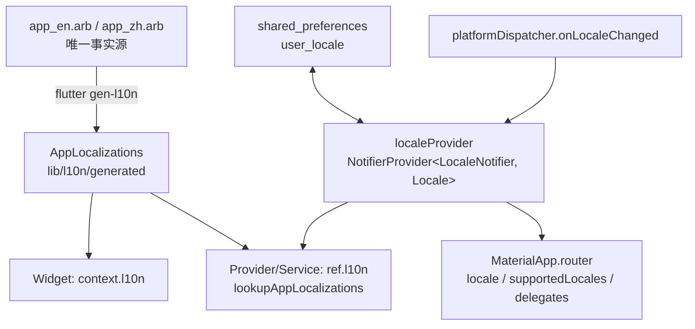

# 国际化（i18n）与本地化（L10n）实施设计

> 日期：2026-08-14
> 范围：FastapiAdmin Flutter 移动端（`fastapiadmin_mobile`）
> 依据：《Flutter + OpenHarmony 国际化全指南》核心概念 + 启运网司机端沉淀方案（`flutter_driver/docs/2026-08-13-i18n-design.md`，已适配本项目 token/Provider 约定）
> 状态：**架构已落地 + 全部页面迁移完成**；服务层/权限模块文案（P3）按本文档路线图推进

---

## 0. 摘要

本项目以 Flutter 官方 `gen_l10n`（ARB 文件）为**唯一事实源**，`AppLocalizations` 为类型安全访问层，配合 Riverpod 语言状态实现**运行时热切换**；`context.l10n`（Widget）/ `ref.l10n`（Provider/Service）双访问入口解决「非 Widget 场景无 BuildContext」问题。切换入口在「设置 → 语言设置」（跟随系统 / 中文 / English）。

已覆盖：登录页、主框架 3 Tab、首页、我的、个人资料、设置、账号、问题反馈、工作列表（5 模块工厂 + 占位页）、启动页、路由占位页标题。约 120 个 key（zh/en）。

---

## 1. 概念映射

| 概念                   | 本项目落地                                                                       | 状态   |
| ---------------------- | -------------------------------------------------------------------------------- | ------ |
| i18n（抽离字符串）     | `lib/l10n/app_zh.arb` + `app_en.arb` 为唯一事实源                                | 已落地 |
| L10n（多地区资源）     | ARB 中/英；`flutter_localizations` 提供 Material 内置组件本地化                  | 已落地 |
| 类型安全访问层         | `flutter gen-l10n` → `lib/l10n/generated/AppLocalizations`                       | 已落地 |
| ARB 占位符             | `loginNetworkError`/`workListTotal`/`splashSkip`/`workPlaceholderComing`（4 例） | 已落地 |
| 动态语言切换           | `localeProvider`（Riverpod Notifier）+ 设置页入口                                | 已落地 |
| 跟随系统               | `platformDispatcher.onLocaleChanged` 监听，`preference == null` 时即时生效       | 已落地 |
| 持久化                 | `shared_preferences` 的 `user_locale`（仅存语言码）                              | 已落地 |
| 复数（plural）         | 预留：`{count, plural, ...}` 语法，gen_l10n 自动生成 `xCount(...)`               | 按需   |
| RTL                    | 当前无阿拉伯语需求；布局多用对称写法，新增语言时仅补 ARB + 复查布局              | 预留   |
| 自动化翻译平台         | ARB 即源文件，天然可上传 Lokalise/Crowdin                                        | 待接入 |
| 服务层/后台文案 key 化 | 网络拦截器 toast、权限模块默认文案（P3）                                         | 待推进 |

---

## 2. 架构



### 2.1 目录结构

```
lib/
├── l10n/
│   ├── app_en.arb            # 模板（英文）
│   ├── app_zh.arb            # 中文
│   └── generated/            # gen_l10n 产物（提交进仓库，相对路径导入）
├── provider/locale/
│   └── locale_provider.dart  # localeProvider + LocaleNotifier
└── common/i18n/
    └── app_l10n.dart         # context.l10n / ref.l10n 扩展
```

### 2.2 语言状态（`localeProvider`）

- `NotifierProvider<LocaleNotifier, Locale>`（Riverpod 3 **Notifier** 风格，对齐项目约定），state 恒为具体 `Locale`（`zh`/`en`），不出现 null。
- `preference == null` 表示「跟随系统」：启动/系统语言变化时用 `platformDispatcher.locale` 最佳匹配（不匹配回退 `zh`，中文为主）。
- 用户选择持久化到 `shared_preferences` 的 `user_locale`（仅存语言码）。
- 资源释放用 `ref.onDispose`（Riverpod 3 无覆写式 `dispose`）移除 `onLocaleChanged` 监听。

### 2.3 访问层（解决「非 Widget 场景无 BuildContext」）

```dart
extension AppL10nContext on BuildContext {
  AppLocalizations get l10n => AppLocalizations.of(this);
}

extension AppL10nRef on WidgetRef {
  AppLocalizations get l10n => lookupAppLocalizations(watch(localeProvider));
}
```

- **Widget**：`context.l10n.xxx`（走 `Localizations` 继承组件，随 `MaterialApp.locale` 自动重建）。
- **Provider / Service**：`ref.l10n.xxx` → 按当前语言同步构造，**无需 BuildContext**，随 `localeProvider` 变化自动重建。

### 2.4 平台原生组件本地化（相机/权限弹窗等）

Flutter 层的 i18n 仅控制 Dart 代码中的字符串。**系统原生组件**（相机界面、权限弹窗、PHPickerViewController 等）的语言由平台原生配置决定：

| 平台        | 原生组件语言控制                                                                                      | 是否需要额外配置 |
| ----------- | ----------------------------------------------------------------------------------------------------- | ---------------- |
| **iOS**     | `Info.plist` 的 `CFBundleLocalizations` 声明支持的语言列表。**未声明时 iOS 回退英文**，即使系统是中文 | ✅ **必须配置**  |
| **Android** | 系统组件直接跟随设备语言，无需额外声明                                                                | ❌ 不需要        |

**iOS 修复**（2026-08-21）：项目原缺少 `CFBundleLocalizations`，导致拍照/权限弹窗等系统组件显示英文。已在 `ios/Runner/Info.plist` 添加：

```xml
<key>CFBundleLocalizations</key>
<array>
    <string>zh</string>
    <string>en</string>
</array>
```

> **规则**：新增支持语言时，除了补 ARB 文件，iOS 端也必须在 `CFBundleLocalizations` 数组中追加语言码，否则系统组件不会跟随切换。

---

## 3. 接入（MaterialApp）

`lib/main.dart`：

```dart
MaterialApp.router(
  locale: ref.watch(localeProvider),                 // 恒为具体 Locale
  supportedLocales: LocaleNotifier.supportedLocales, // [zh, en]
  localizationsDelegates: AppLocalizations.localizationsDelegates, // 含 Global* 三件套
  ...
)
```

`AppLocalizations.localizationsDelegates` 自带 Global Material/Widgets/Cupertino 三件套，Material 内置组件（日期选择、Tooltip 等）自动随语言本地化。

---

## 4. ARB 规范

### 4.1 命名

- 描述性 key + 模块前缀：`loginTitle`、`workListTotal`、`settingsLanguage`、`profileSaveSuccess` 等。
- 占位符需 `@key.placeholders` 元数据；**`example` 必须为非空字符串**（数字也写成 `"100"`，否则 `flutter gen-l10n` 报错）。

```jsonc
{
  "workListTotal": "共 {total} 条记录",
  "@workListTotal": {
    "placeholders": { "total": { "type": "int", "example": "100" } },
  },
}
```

### 4.2 参数调用

`l10n.yaml` 开启 `use-named-parameters: true` → 生成方法用**命名参数**：

```dart
context.l10n.workListTotal(total: _total)
context.l10n.loginNetworkError(message: e.message ?? '')
context.l10n.splashSkip(count: countdown)
context.l10n.workPlaceholderComing(title: title)
```

### 4.3 key 完整性

`flutter gen-l10n` 遇缺失 key / example 类型错误即失败（CI 门槛）。

### 4.4 复数（预留）

后续按需 `{count, plural, =0{...} one{...} other{...}}`。

---

## 5. 迁移清单（已完成）

| 页面/模块                      | 说明                                                                                                     |
| ------------------------------ | -------------------------------------------------------------------------------------------------------- |
| 登录页 `login_page.dart`       | 表单/toast/校验/按钮全量；`on Exception` 与 `DioException` 走 `loginNetworkError`                        |
| 主框架 `main_page.dart`        | 底部 3 Tab 标签 + 工作台占位文本                                                                         |
| 首页 `home_tab.dart`           | 导航/统计**静态 const 列表 → `_items(l10n)` 方法**；公告文本                                             |
| 我的 `mine_tab.dart`           | 弹框/退出/toast；工具与服务列表 l10n 化；`_MenuItemData` 加 `route` 字段（点击逻辑不再 switch 中文标题） |
| 个人资料 `profile_page.dart`   | 各信息卡/输入提示/保存 toast；头像权限描述                                                               |
| 设置 `settings_page.dart`      | **语言切换入口**（跟随系统/中文/English）+ 各设置项                                                      |
| 账号 `account_page.dart`       | 修改密码表单/校验/成功 toast                                                                             |
| 问题反馈 `feedback_page.dart`  | **类型列表改稳定枚举** `_FeedbackType` + `_typeLabel(type, l10n)`；toast/标签                            |
| 工作列表 `work_list_page.dart` | 加载失败/重试/空态/总数占位；状态「正常/停用」；5 个模块工厂标题与**列标签**；占位页                     |
| 启动页 `splash_page.dart`      | 副标题 + `splashSkip(count:)`                                                                            |
| 路由 `app_router.dart`         | 占位页标题 `context.l10n.workTitleMenu` 等                                                               |

### 5.1 反模式（★ 全量迁移教训）

- **❌ `substring` 按字数切分富文本链接**（英文下字符数全变）→ 每段独立 key + `Text.rich` 拼接。
- **❌ 用本地化字符串做比较/状态**（如 `_selectedType == '功能异常'`、`switch(item.title)`）→ 稳定枚举 / 独立字段（`route`）。
- **❌ 静态 `const` 列表存 UI 文案** → 改为 `_items(l10n)` 方法在 build 内构建。
- **❌ 占位符 example 写数字** → 必须字符串（`"100"`）。

---

## 6. 测试策略

- **key 完整性**：`flutter gen-l10n` 缺失即失败（CI 门槛）。
- **切换测试**：`SharedPreferences.setMockInitialValues` + 覆盖 `localeProvider` → 断言 `MaterialApp.locale` / 页面文案随切换更新（待补，见 §7）。
- **既有测试**：`widget_test.dart` 为模板计数器冒烟测试，与 FastapiAdmin 应用不符（既有失败，可改为「App 正常 pump 不抛异常」）；其余 14 个测试不受影响。
- 有页面测试时：`MaterialApp` 需补 `localizationsDelegates: AppLocalizations.localizationsDelegates`（提供测试 helper）。

---

## 7. 待办 / 已知边界

- [x] 架构（ARB / provider / 访问层 / MaterialApp 接入 / gen-l10n）
- [x] 全部页面文案迁移 + 语言切换入口（设置 → 语言设置）
- [ ] **P3**：服务层文案 key 化（网络拦截器 toast：`连接超时`/`网络连接失败`/`加载中...`、`common/utils/loading.dart`、`avatar_provider` 错误提示）
- [ ] 权限模块默认文案 key 化（`common/permission/permission_constants.dart` / `permission_widgets.dart`）
- [ ] 数字/货币/日期格式化（`intl` `DateFormat`/`NumberFormat`）
- [ ] i18n 切换 widget 测试 + 测试 helper
- [ ] 自动化翻译平台接入（Lokalise/Crowdin，需业务侧账号）
- [ ] 修正 `widget_test.dart` 模板冒烟测试
